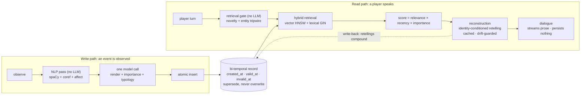

# twicetold-npc

> Renamed from longmem-npc (September 2026): the old name collided with an established
> research-project prefix. Same repo, same history; the full README rebuild lands with the
> v1 release.

Self-hostable long-term-memory service for game NPCs: FastAPI + PostgreSQL/pgvector backend plus a
Unity-embeddable client package. Characters get psychologically plausible memory: an immutable
bi-temporal record underneath; identity-conditioned reconstructive recall and believable decay
above it. *A psychology, not a database.*

The claim it is built to defend: **memory should be reconstructed at recall time, not replayed.**
The record underneath is never edited: corrections supersede, they do not overwrite. What the
character *tells you* is re-told through who they currently are, and drifts as time passes.
Both halves are inspectable side by side.

> **Status (August 2026): mid-build, public, measured.** The core loop is built end to end and
> verified: write path, retrieval, reconstruction, streaming dialogue, the C# client, a Unity
> reference scene, and a browser inspector. The [25-row verified-floors table](docs/floors.md)
> and a 108-scenario test suite are the evidence. Reflection, the purge endpoint, and a dedicated
> latency pass are still ahead, so every number below is pre-optimization. This README describes
> the current verified state; I'll rewrite it around the demo when the demo video and packaged
> release ship.

## How a turn works



**Writing.** An observe event runs a no-LLM NLP pass (spaCy `en_core_web_lg`, `fastcoref`
coreference, VADER + Warriner affect), then one model call renders the memory prose, scores
importance, and classifies typology, then an atomic insert lands every write-time fact. An
escalation pass catches hard cases and is deliberately biased loose: a wasted call is cheap, a
lost gist breaks the product. Deferred write processing (Engram-style) can push the model calls
to a background worker while the raw text is stored and embedded synchronously: immediately
retrievable, enriched at the service's own pace. It ships default OFF, and the synchronous path
is proven byte-identical with the flag down.

**Reading.** The retrieval gate is non-LLM by design (a novelty check plus an entity tripwire;
there is no gate model). Retrieval is hybrid: pgvector HNSW cosine over 1536-dim embeddings,
unioned with a lexical GIN channel before scoring, and every served item returns its score
decomposed as `relevance × recency × importance`. Memories past their decay threshold are not
replayed; they are **reconstructed**: retold through the character's current identity, cached
for byte-identical rereads within a scene, drift-guarded against topic swaps, and written back
so retellings compound over time. The dialogue role then streams pure prose. A dialogue turn
persists nothing.

**Correcting.** A correction supersedes the memory's fact head and re-embeds it, so *retrieval
follows the fix*: the corrected content is what ranks from then on. Pinning a memory exempts
it from decay and excludes it from reconstruction: some things are never retold loosely.

Model roles are six env vars (nothing hardcoded; all six currently run Claude Haiku 4.5), plus
an eval-only judge var (Claude Opus 4.8) kept deliberately separate so the judge never grades
its own model's prose. Embeddings are OpenAI `text-embedding-3-small`, dimension locked at
1536. The service surface is twelve routes: eleven in the OpenAPI schema plus the served
inspector page. On the game side, `NpcMemory.Core` is a netstandard2.1 C# client with zero
`UnityEngine` references, consumed by the Unity reference scene as a committed DLL and proven
against the live service by a 24-check console harness.

## The record underneath

Every memory carries three timestamps: `created_at` (when it was written), `valid_at` (when it
happened in world time), and `invalid_at` (when it was superseded, if ever). Nothing is updated
in place and nothing is deleted: superseded rows survive and stay queryable. Where most LLM
memory stacks compress destructively (the summary replaces the source), here the observation is
immutable and everything above it is versioned retelling. Recency decay and bi-temporal
invalidation are distinct mechanisms (decay hides detail at read time without touching rows;
correction stamps rows without touching decay), and the test suite proves the separation. The
one sanctioned DELETE in the whole design is a purge endpoint (the GDPR surface), deliberately
not built yet.

The Ledger, a zero-build inspector page served by the API at `/ledger`, puts that record on
screen:


*One memory's record in The Ledger: the immutable observation beside the current telling, both
version chains below, superseded rows greyed but never dropped. The pinned fire, the corrected
errand, and a month-old memory retold by an innkeeper who was there.*

## Measured

Numbers from the current rig, dated, all pre-optimization. Latency is structural
instrumentation (every payload carries per-stage timings and token counts, so the per-100-turn
cost table is generated, not estimated).

| Measurement | Value | Context |
|---|---|---|
| Perceived first word, p50 | **943 ms** | streaming dialogue turn, Haiku prose role, against a 1 s bar (2026-08-12 compare) |
| Same, Sonnet 5 arms | 2626 / 2086 ms | thinking on / off; both ruled out on latency |
| Dialogue cost | ~$0.92–0.94 / 100 turns | priced via env vars; token counts are unconditional |
| Cache-hit reconstruction reread | 13 ms | call-free by design |
| Gist survival, constraint ON → OFF | 0.8335 → 0.7036 | the ablation below |

The model choice was ruled on latency with the prose verdict on the record: the judge preferred
the slower model's prose, and the ruling took the sub-second first word anyway. In play, the
wait breaks the illusion before the wording does.

Two evaluation results I'd call load-bearing:

- **The fixed-gist ablation.** Turning the gist constraint off drops gist-precision (fact
  survival through retelling) from **0.8335 to 0.7036**, while the drift budget stayed under
  threshold in *both* arms: proof that embedding distance alone is blind to fact-level damage.
  The budget was re-scoped to what it actually catches (topic swaps), and factual faithfulness
  is policed by the gist constraint at generation plus judged faithfulness at eval.
- **Judge validation.** Against a 78-row gold file labeled blind before any verdicts were seen:
  selective-forgetting kappa 0.75, abstention kappa 1.00. Natural faithfulness agreement came
  back degenerate (both raters approved everything, reported honestly as a failed bar rather
  than spun), so a 34-row constructed-truth set closed it: the judge discriminated every known
  contradiction, reversal, and invented answer correctly (kappa 1.00). The judge layer exists
  because lexical metrics can't do this: strict-lexical gist scoring read 0.765 where the
  judge's semantic read was 0.9888, and the judge flagged 63 embellishments where the lexical
  entity detector saw 2.

The full apparatus (scenario runner, drift validation, A/B compares, gold emission, agreement
gates, the ablation rig) lives in [docs/eval-harness.md](docs/eval-harness.md).

## How it's verified

- **Verified floors.** Every layer is verified against the known-good layer beneath it, and a
  row lands in [docs/floors.md](docs/floors.md) only after an independent verifier pass returns
  pass; 25 rows stand today, from the schema up through deferred writes. Floors are re-openable:
  re-verifying one is the normal cost of a design improvement, never an argument against one.
- **The suite.** 108 pytest scenarios, offline and keyless; the 94-scenario fast subset runs
  mechanically at the end of every working turn via a repo hook. The one rule: assertions bind
  IDs, chain shape, timestamps, and byte-identity. **A model's wording is not a test surface.**
- **The walkers.** Eight deep verification scripts (`tests\verify_*.py`), one per layer: a
  walker proves a layer once, thoroughly, at build time; the suite keeps it proven forever,
  cheaply. Latest full-slate counts: write 53 (that file is byte-untouched since 2026-08-04,
  which doubles as the deferred-OFF parity proof), read 56, dialogue seam 51, gate 51,
  reconstruction 42, authorial correction 34, fact correction 34, deferred writes 51.
- **The registers.** An append-only decision register (3,100+ lines of dated rulings with
  rationale), an append-only session log, and append-only floor evidence. When a mid-build
  re-design made a shipped subsystem wrong, it was removed whole and the floors re-verified;
  the registers record both the building and the unbuilding.
- **Research provenance.** The design followed a 45-paper sweep, and
  [docs/research/CHANGES-FROM-RESEARCH.md](docs/research/CHANGES-FROM-RESEARCH.md) maps every
  landed change to its source paper.

This is a solo project built in 32 days of logged sessions (first commit 2026-07-12) with an AI
pair, run under a fixed loop: design forks get surfaced as options, I rule on them, the build
lands with its walker, an independent verifier re-runs the floor, docs and commit close the
session. The `.claude\` apparatus that enforces the loop (auditor agents, verification hooks,
the operating rules in `CLAUDE.md`) is tracked in this repo on purpose: the process is part of
the work.

## Quickstart

[docs/SETUP.md](docs/SETUP.md) takes a fresh clone to a running system. Short version,
PowerShell:

```powershell
python -m pip install -r requirements.txt
Copy-Item .env.example .env    # then edit it
docker compose up -d
python db\migrate.py
python -m app.serve
```

It runs offline and keyless by default (`TWICETOLD_PROVIDER_MODE=fake`): no API key needed to
explore. Then open `http://127.0.0.1:8000/ledger`, or drive a character from the REPL with
`python -m app.cli --agent <uuid> --debug`. Two honest caveats: the install is heavy (spaCy
model wheels plus transformers), and the first observe in a process pays a multi-minute lazy
NLP load.

## What this is not

- **Not a hosted service.** No auth, no rate limiting; the API binds `127.0.0.1:8000`. It runs
  next to your game, on your machine.
- **Not finished.** The purge endpoint is a documented contract without a handler, and the
  three background workers (deferred writes, reflection, the parameter compiler) ship
  default OFF until the tuning pass turns them on.
- **Not optimized.** The dedicated latency pass (reconstruction pre-warm, prompt caching,
  concurrency caps) hasn't happened; today's numbers are the floor, not the ceiling.
- **Not platform-neutral in its docs.** Setup is written Windows/PowerShell-first and assumes a
  global Python 3.14.
- **Not multilingual.** The write-time NLP pass is English-only.

## What's next

Reflection (evidence-cited beliefs, a repetition detector, periodic identity refresh), the
parameter compiler (formed beliefs compiled into per-scene personality weights), and
dissonance-driven defense (an in-world confrontation event: the NPC either rationalizes its
story or grudgingly updates it, decided by a tunable evidence formula) are now built. In
order from here: client-contract completion, the purge endpoint, then the latency pass.
After that: the demo video, a Unity package, and one-command backend spin-up, at which point
this README gets rebuilt around the demo.

## Repository layout

| Path | What it is |
|---|---|
| `app\` | the service: ingest, retrieval, reconstruction, the gate, the dialogue seam, the HTTP routes, the eval runner |
| `db\` | numbered migrations (001–007) and the transactional migration runner |
| `tests\` | the pytest suite + eight structural done-when walkers |
| `client\` | `NpcMemory.Core`, the engine-agnostic C# client, plus a console harness |
| `unity\` | the Unity 6 gray-box demo project: a thin adapter over the client, plus the set |
| `ledger\` | The Ledger: a browser inspector for the record, served by the API at `/ledger` |
| `data\` | eval scenarios, arms, blind gold labels, and the bundled affect lexicon |
| `docs\` | design truth, build specs, and the append-only registers; start at `docs\README.md` |
| `.claude\` | the AI-pair apparatus: auditor agents, verification hooks, session commands |

## Where to read next

- [docs/README.md](docs/README.md): the index, what every doc is for, and the reading order
- [docs/architecture.md](docs/architecture.md): the design truth, in thirteen sections
- [docs/status.md](docs/status.md): where the project stands right now, and what is queued
- [docs/decisions.md](docs/decisions.md): every ruling, what it beat, and why
- [docs/floors.md](docs/floors.md): what has actually been verified, and against what

## Research lineage

The mechanisms trace to named sources: **Engram** (arXiv 2606.09900) shaped deferred write
enrichment and the lexical retrieval channel, with the sleep-time-compute family behind the
idle-work framing; **RaMem** (2606.22844) the encoding-context read term; **CoALA** the
supersede-vs-decay split; **Talk of the Town** and **Bartlett** the compounding-retellings
write-back; **LoCoMo** (2402.17753) the retargeted FactScore; **LongMemEval** (2410.10813,
2605.12493) the abstention and premise-awareness rubric; **MemoryAgentBench** (2507.05257) the
selective-forgetting construction; **Fixed-Persona SLMs** (2511.10277) keyword retention.
[docs/research/CHANGES-FROM-RESEARCH.md](docs/research/CHANGES-FROM-RESEARCH.md) maps each
landed change to its paper.

## License

Apache-2.0 ([LICENSE](LICENSE)); third-party inventory in [NOTICE](NOTICE): psycopg is the one
copyleft dependency (LGPL-3.0-only, not vendored), and the bundled Warriner 2013 VAD lexicon is
CC-BY-4.0 with attribution in `data\lexicons\`. Built by Jackson Zane.
