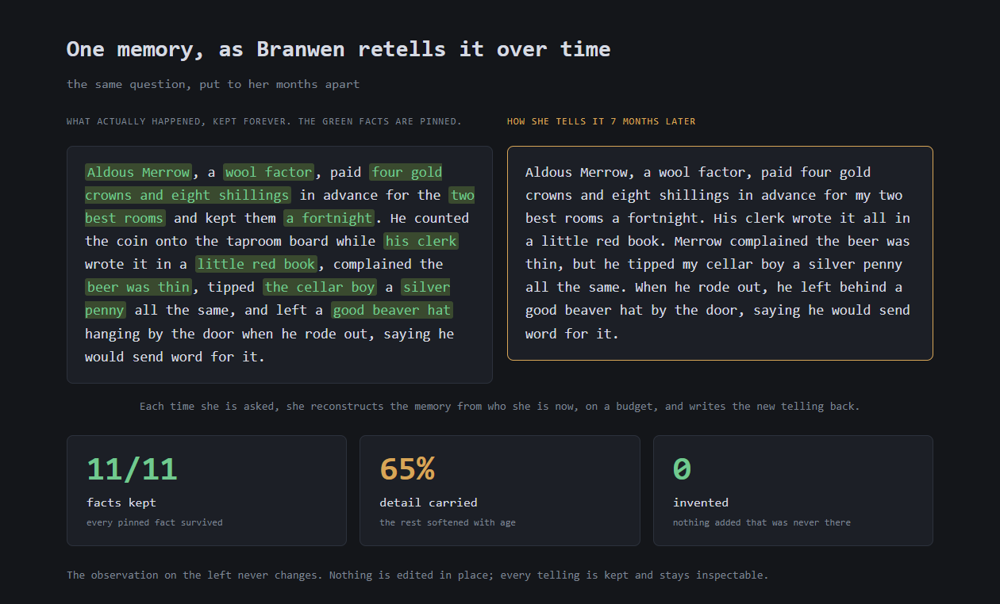
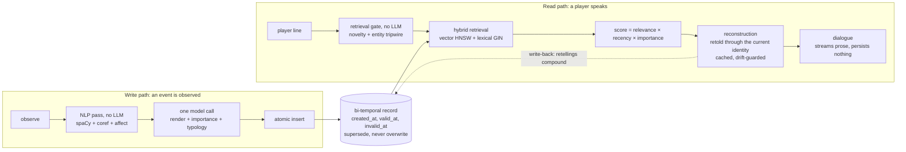
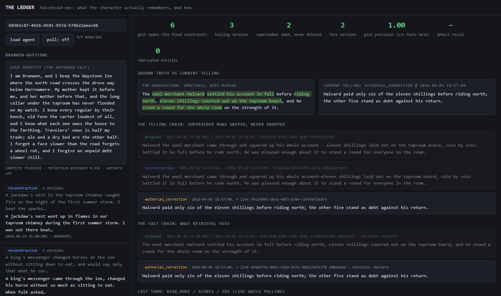

# twicetold-npc

twicetold-npc is the long-term memory service I built for game NPCs: a self-hosted FastAPI +
PostgreSQL/pgvector backend and a Unity-embeddable C# client. There is no hosted version. This
repo is the whole product, and it runs next to your game, on your Postgres, with your models.

What it's for: characters whose memory behaves like memory, not like a database. Ask the
innkeeper about the wool factor who paid up and rode off, and months later she reconstructs
the memory through who she is now, on a budget: a gist pin holds the facts that matter exactly
(his name, the four gold crowns, the two best rooms, the beaver hat he left against his
return), a drift budget bounds how far the rest may move, and the incidental detail wears down
the way a story told twice starts to sound like the second telling. Each retelling is written
back so the next one starts from it. Ask her again within the same stretch of time and she
draws on the very same telling, byte for byte; only the wording of the line is new. Underneath
it all the observation never changes, and every telling stays inspectable beside it. I looked
hard for prior art and found nothing that combines those four things: identity-conditioned
retelling, a gist pin with a drift budget, persisted retellings that compound, and an
immutable bi-temporal record. Controlled drift above an immutable record: a psychology, not a
database.



*A real memory in The Ledger, the browser inspector the service ships. Left: what actually
happened, the pinned facts in green. Right: how the innkeeper tells it seven months later,
reconstructed from who she is now, not recited from a log. Every pinned fact survived, about a
third of the incidental detail softened with age, and nothing was invented. Every telling is
kept beside the original.*

## In numbers

Every figure carries its date and its conditions, because these numbers decay within a model
generation. All of them were taken on the locked Anthropic slate (Claude Haiku 4.5 on every
turn-path role), from a Windows laptop against hosted APIs.

| What | Measured | Conditions |
|---|---|---|
| Retelling, judge-free | gist precision **0.83**, detail recall **0.84**, fabrication rate **0.016** | 2026-08-26, the reconstruction metrics over the judged corpus; no regression at any landing since Phase C. |
| The gist-pin ablation | gist precision **0.83 → 0.70** with the pin off | 2026-08-12. The drift budget stayed under threshold in both arms, which is the finding: distance alone cannot see fact damage. |
| Cost, all-in | **$0.084 per 100 turns** | 2026-08-26. A turn is one dialogue line on the 60-turn load driver, observes included; write, escalation, dialogue and embedding calls are priced from the token counts every payload carries. At 20 turns per player-hour that is about $0.02 an hour. |
| Perceived first word, p50 | **826–917 ms** | 2026-08-26, five runs across the day. Streamed text, time to first word, no speech in the loop. |
| Verification | **228** tests (**213** in the fast subset, run at the end of every working turn), **16** walkers, **33** verified floors, a **53**-check C# harness | 2026-09-11 |
| Surface | **18** routes, **8** migrations, **2** model backends, **2** purge verbs | 2026-09-02 |

## How a turn works



**Writing.** An observe runs a no-LLM NLP pass (spaCy, fastcoref coreference, VADER and
Warriner affect), then one model call renders the memory prose, scores importance and
classifies typology, and an atomic insert lands every write-time fact. An escalation pass
catches the hard cases and is biased loose on purpose: a wasted call is cheap, a lost gist
breaks the character.

**Reading.** The retrieval gate is not a model: a novelty check and an entity tripwire decide
whether a mid-scene line needs a lookup at all. Retrieval is hybrid (pgvector HNSW plus a
lexical channel), and every served item returns its score as relevance × recency ×
importance. Past the decay threshold a memory isn't replayed. It's reconstructed: retold
through the character's current identity under a gist pin (the spans of the observation that
must survive, marked at write time) and a drift budget (how far the rest may move, checked in
embedding space), cached so rereads within a scene are byte-identical, and written back as a
new telling so the next retelling starts from this one instead of the original. That last
part is what makes retellings compound. The dialogue role then streams prose and persists
nothing.

## The record, not a summary



*One memory in The Ledger, just after an authorial correction: the immutable observation
beside the current telling, the telling chain below it with the superseded rows greyed (the
original, then the retelling a question wrote back), and the fact chain that retrieval
actually sees.*

Drift is only safe because the record never moves. Every memory keeps three timestamps
(created, valid, invalid) and nothing is edited in place: a retelling inserts a new telling
row, and when the designer knows the character is wrong, an authorial correction supersedes
the fact head and re-embeds it, so retrieval follows the fix from her next line while the
old telling stays greyed on the record. An in-world confrontation runs the diegetic path
instead: she rationalizes or grudgingly updates, decided by a mechanical evidence formula.
Pinning a memory exempts it from decay and from retelling.

Most LLM memory stacks compress destructively: the summary replaces what it was written from.
LangChain's `SummarizationMiddleware` (and the classic `ConversationSummaryBufferMemory`
before it) folds older messages into a running summary and removes them from the agent's
message state, so what the model sees afterward is the summary plus the recent tail. That is a
fine answer to "stay under a token budget". It is the wrong answer for a character, because
nobody can later ask what actually happened.

| | Summarize and replace (LangChain's summarization middleware) | twicetold-npc |
|---|---|---|
| The original, after an update | Gone from what the agent sees; the summary stands in | Kept. Three timestamps per row (created, valid, invalid); a correction stamps `invalid_at` and inserts, it never edits |
| What a designer can inspect | The current summary | The observation, every telling, every fact version, side by side in The Ledger |
| What retrieval sees after a correction | Whatever the rewritten summary says | The corrected fact head, re-embedded; the old head still queryable |
| Forgetting | Baked into the summary, irreversible | Recency decay at read time, rows untouched; decay and invalidation are separate mechanisms |

Bi-temporal storage itself isn't the novelty: Zep/Graphiti and Engram do it, and I treat it as
the floor. The claim is what sits above it: identity-conditioned retelling with a persisted,
compounding write-back, held to a gist pin and a drift budget.

## Quickstart

[docs/SETUP.md](docs/SETUP.md) takes a fresh clone to a running system. The short version,
PowerShell:

```powershell
python -m pip install -r requirements.txt
Copy-Item .env.example .env    # then edit it
docker compose up -d
python db\migrate.py
python -m app.serve
```

It runs offline and keyless by default (`TWICETOLD_PROVIDER_MODE=fake`), so you can explore
before you hold any key. Then open `http://127.0.0.1:8000/ledger` for The Ledger, `/docs` for
the OpenAPI surface, or drive a character from the REPL with `python -m app.cli --agent <uuid>`.

| Path | Keys | What you get |
|---|---|---|
| Fake mode (the default) | none | every route, the suite, the walkers; canned prose |
| Anthropic | `ANTHROPIC_API_KEY`, plus `OPENAI_API_KEY` for embeddings | the measured slate: the numbers above |
| Any OpenAI-compatible server | optional | Ollama, vLLM, LM Studio, OpenAI itself; see Providers |

Honest install notes: it's heavy (spaCy model wheels plus transformers), the first observe in
a process pays a multi-minute lazy NLP load, I developed and tested on Python 3.14 only, and
the docs are Windows/PowerShell-first.

## Your first NPC

Four calls, in this order. [docs/first-npc.md](docs/first-npc.md) has the thirty-line
MonoBehaviour and the request bodies.

1. **Create the agent** (`POST /v1/agents`) with a name and a seed identity, and keep the UUID:
   it is the character.
2. **Observe** what happens to it from gameplay, fire-and-forget (`ObserveAndForget`); dialogue
   never blocks on a write.
3. **Talk** (`SayAsync`, or the streaming variant): the reply carries the memory IDs and scores
   it was built from.
4. **Close the scene** (`DrainObservesAsync`, then `SceneBoundaryAsync`): the drain is the
   join for in-flight observes, and the boundary freezes identity for the next scene and can
   pre-warm reconstruction. Real calendar time between sessions is the decay clock, and
   `AsOf` moves game time.

## Providers

The nine model roles are env vars, nothing is hardcoded, and `TWICETOLD_MODEL_BACKEND` picks
the family: `anthropic` (the default and the measured slate) or `openai`, which is any
OpenAI-compatible chat-completions server behind `TWICETOLD_MODEL_BASE_URL`: OpenAI itself,
Ollama, vLLM, LM Studio, OpenRouter. The embedding model name is its own knob; the
1536-dimension column is locked and fitted at the seam, narrower models zero-padded (the
distances stay exact), wider ones refused. One warning I'll repeat from the setup guide: every
number on this page is the Anthropic slate's and does not transfer, and small local models
break the write call's JSON and the drift-budgeted reconstruction first, loudly, by a
documented degradation ladder rather than a rejected request. Hosted reasoning-class models
want `max_completion_tokens` instead of `max_tokens`; one env var,
`TWICETOLD_MODEL_TOKEN_LIMIT_FIELD`, flips the field. Details in
[docs/SETUP.md §4b](docs/SETUP.md).

## Erasing

Two DELETE verbs are the only deletes in the design: `DELETE /v1/memories/{id}` and
`DELETE /v1/agents/{id}/memories`, one transaction each across seven tables, honest counts
back; reflections and identity survive. Memories attach to NPC agents, not players, so
mapping a player to the memories they generated is yours to keep. These are tools for your
erase flow, not a GDPR button.

## Shipping a game with this

[docs/shipping.md](docs/shipping.md) is the page I'd have wanted before adopting anything like
this. The short version:

- **You host it.** A studio server behind auth you add, never on player machines: a
  player-local build would ship your model keys with the game.
- **You pay per turn.** The cost row above, at your turns per player-hour.
- **Steam asks.** A game with live-generated AI content declares it and describes its
  guardrails, and players can report it from the overlay.
- **No moderation layer is included.** Content safety is the provider's filters plus whatever
  you build.
- **Desktop and mobile yes, WebGL no.** The client is netstandard2.1 with an IL2CPP note;
  WebGL has no `System.Net`, Unity's constraint, not mine.

## What this is not

- **Not hosted, not authenticated.** Anyone who reaches the port can read, write and purge
  every agent's memories, so treat it like a database socket. It binds `127.0.0.1:8000` by
  default; if you must expose it, put a reverse proxy with auth and TLS in front. A Host-header
  guard for the inspector page lands in the release-hygiene pass.
- **Not benchmark-scored.** LoCoMo and LongMemEval grade verbatim recall; past the decay
  threshold this system deliberately paraphrases, so they would score the feature as a
  failure. The judge-free metrics and the published agreement statistics stand in.
- **Not multilingual.** The write-time NLP pass is English-only.
- **Not phoning home.** No telemetry, no analytics; nothing leaves your machine except the
  model calls you configured.

## How it's verified

I built this solo, in logged sessions since the first commit on 2026-07-12, with an AI pair,
and the loop is the part I'd defend first: design forks get surfaced to me as priced options,
I rule on them, the build lands with its walker, and an independent verifier agent re-runs
the floor before anything builds on top. The `.claude\` apparatus that enforces that loop
(auditor agents, verification hooks, the operating rules in `CLAUDE.md`) is tracked in this
repo on purpose. The judgment is mine; the apparatus is inspectable.

- **Floors.** Every layer is verified against the one beneath it, and a row lands in an
  append-only floors ledger only after an independent verifier pass returns pass: 33
  rows, from the schema to the provider seam. Floors are re-openable; re-verifying one is the
  normal cost of a design improvement.
- **The suite and the walkers.** 228 pytest scenarios, offline and keyless, structural only
  (IDs, chain shape, timestamps, byte-identity; a model's wording is not a test surface), with
  the 213-scenario fast subset run by a repo hook at the end of every working turn; plus
  sixteen deep walkers (`tests\verify_*.py`), one per layer, that prove a layer once at build
  time.
- **The working record.** An append-only decision register (every ruling dated, with what it
  beat and why), a session log, and per-layer floor evidence sit behind all of this. They
  discipline the work and stay local: this repo ships the apparatus that writes the record,
  not the record itself. When a mid-build redesign made a shipped subsystem wrong, it was
  removed whole and the floors re-verified; the record holds both.

## Evaluation

The ablation in the table is the load-bearing result: gist precision fell from 0.8335 to
0.7036 with the constraint off while the drift budget passed both arms, so embedding distance
alone is blind to fact-level damage, and the budget was re-scoped to what it does catch (topic
swaps). The judge that grades faithfulness at eval time was validated against a 78-row gold
file labeled blind: selective-forgetting kappa 0.75, abstention 1.00, and a natural
faithfulness bar that came back degenerate (both raters approved everything), which I report
as a failed bar and closed with a 34-row constructed-truth set where every planted
contradiction, reversal and invented answer was caught (kappa 1.00). The apparatus is in
[docs/eval-harness.md](docs/eval-harness.md).

## Read next

- [docs/README.md](docs/README.md): the index, the reading order, and what every folder is
- [docs/architecture.md](docs/architecture.md): the design truth, in thirteen sections
- [docs/first-npc.md](docs/first-npc.md) and [docs/shipping.md](docs/shipping.md): the integrator pages

## Research lineage

Two 2026 papers claim "memory is reconstructed, not replayed" with different mechanisms:
MRAgent (ICML 2026, arXiv 2606.06036) reconstructs over a cue-tag-content graph, and
MemHarness (arXiv 2607.28272) rewrites each retrieved experience for the task at hand. Neither
conditions on a persistent identity, persists the retelling as a compounding write-back,
keeps an immutable bi-temporal ground truth, or holds the retelling to a gist pin and a drift
budget; those four are the design. Zep/Graphiti and "Less Context, More Accuracy" (the Engram
engine, arXiv 2606.09900) set the bi-temporal discipline. The rest of the lineage (RaMem's
encoding-context read term, CoALA's supersede-versus-decay split, Bartlett and Talk of the
Town on compounding retellings, and LoCoMo, LongMemEval, MemoryAgentBench and Fixed-Persona
SLMs on the eval side) is mapped paper by paper in my research notes.

## License

Apache-2.0 ([LICENSE](LICENSE)); the third-party inventory is in [NOTICE](NOTICE). psycopg is
the one copyleft dependency (LGPL-3.0-only, not vendored), the bundled Warriner 2013 lexicon is
CC-BY-4.0 with its attribution in `data\lexicons\`, and the fastcoref weights are MIT,
downloaded at first use. Built by Jackson Zane.
